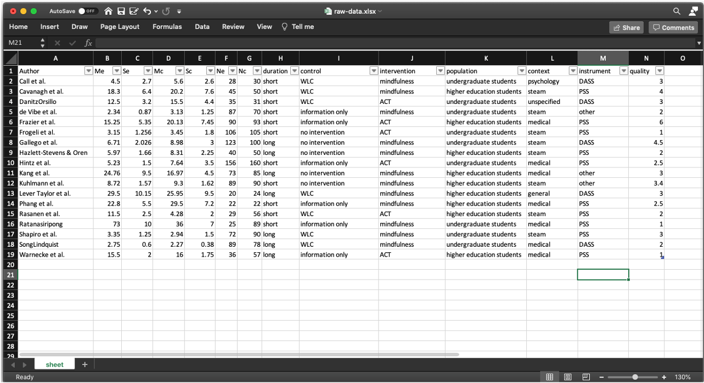

```{r setup, purl=FALSE, include=FALSE, echo=FALSE}
knitr::opts_chunk$set(echo = TRUE)
defaultW <- getOption("warn")
options(warn = -1)
```

Prerequisitos:

 - Instalar R: [https://vps.fmvz.usp.br/CRAN/](https://vps.fmvz.usp.br/CRAN/)
 - Instalar r-studio: [https://www.rstudio.com/products/rstudio/](https://www.rstudio.com/products/rstudio/)

Arquivos:

 - Script em R: [simple-for-continuos-data.R](simple-for-continuos-data.R)
 - Dados em excel: [raw-data.xlsx](raw-data.xlsx)


# Instalar e carregar pacotes de R necessários

```{r, include=T, echo=F}
install.packages(setdiff(c('meta','metafor','esc','readxl','devtools'), rownames(installed.packages())))
if (!"dmetar" %in% rownames(installed.packages())) {
  devtools::install_github("MathiasHarrer/dmetar")
} 

library(readxl)
library(meta)
library(metafor)
library(dmetar)
library(esc)
```

Lista de pacotes usados:

 - **readxl**: manipulação de arquivos no formato excel .xlsx
 - **meta**: métodos estatísticos de calculo de metanálise 
 - **metafor**: métodos estatísticos de calculo de metaregresão
 - **dmetar**: métodos estatísticos avançados para metanálises (deteção de outliers e metanalises de subgrupos)
 - **esc**: métodos estatísticos para calculo de tamnhos de efeito


# Step 1: Carregar os dados na variável madata

Leitura da folha de cálculo com nome `sheet` e no arquivo `raw-data.xlsx``

```{r}
madata <- read_excel("raw-data.xlsx", sheet = "sheet")
```

*Observação*: Exemplo da folha de cálculo usado no script exemplo




Colunas necessárias na folha de cálculo para realizar metanálises:

 - *Author*  :	Nome dos autores do artigo usando formato `FamilyName, N1. N2. et al.`
 - *Me*	    : Média no grupo intervenção/experimental
 - *Se*      : Desviação padrão do grupo intervenção/experimental
 - *Mc*      :	Média no grupo controle
 - *Sc*	    : Desviação padrão do grupo controle
 - *Ne*      :	Número de participantes no grupo intervenção/experimental
 - *Nc*      : Número de participantes no grupo controle


Colunas necessárias na folha de cálculo para realizar metanálises de subgrupos:

 - *population*      :	População (público-alvo) com o qual foi realizado o estudo empírico
 - *context*	        : Contexto no qual foi realizado o estudo empírico
 - *duration*        : Duração do estudo empírico (usar valores `long` para longa duração e `short` para curta duração)
 - *intervention*    :	Tipo de intervenção utilizada (e.g. tipo de design gamificado aplicado)
 - *control*	        : Tipo de controle utilizado (e.g. tipo de plataforma tradicional usada como sistema não gamificado)
 - *Ne*              :	Número de participantes no grupo intervenção/experimental
 - *Nc*              : Número de participantes no grupo controle


# Step 2: Condução da metanálises sem remover outlier

```{r}
(m.raw <- metacont(Ne, Me, Se, Nc, Mc, Sc, data = madata
                   , studlab = paste(Author)
                   , comb.fixed = F, comb.random = T
                   , sm = "SMD"))
```

*Observação*: A condução padrão no script usa o modelo de efeito aleatorio (random-effect model).
 Para a condução de metanálise usando modelo de efeito fixo (fixed-effect model) use o seguinte código.

```
(m.raw <- metacont(Ne, Me, Se, Nc, Mc, Sc, data = madata
                   , studlab = paste(Author)
                   , comb.fixed = T, comb.random = F
                   , sm = "SMD"))
```


# Step 3: Exclusão de outliers

## Identificação de outliers

### Método boxplot

Para a identificação de outliers usando método boxplot (válido para fixed-effect model), efeituar:
```
(m.ro <- find.outliers(m.raw)) 
```
### Análises de influência

Para a identificação de outliers usando análises de influência (válido para random-effect model e fixed-effect model) empregar:
```
(ia.m <- InfluenceAnalysis(x = m.raw, random = T))
plot(ia.m, "es")
plot(ia.m, "influence")
plot(ia.m, "baujat")
```

### Método GOSH

O método Graphic Display of Heterogeneity (GOSH) é recomendado para metanálises que emprega random-effect model para calcular o efeito geral do estudo.

GOSH calcula ouliers usando todas as comb. possíveis dos 'k' estudos.
No entanto a função `gosh` precissa como parametro de entrada a metaregresão de tamanhos de efeitos.
Assim primeiro efetuamos o calculo de tamanho de efeito mediante a função `effsize`

```{r, echo=F}
effsize <- esc_mean_sd(madata$Me, madata$Se, madata$Ne,
                       madata$Mc, madata$Sc, madata$Nc, es.type = "g")
```                       

Os tamahos de efeito são arquivados na tabela `madata` nas columnas `TE` (tamanho de efeito) e `seTE` (desvio padrão do tamanho de efeito).

```{r, echo=F}
madata["TE"] <- effsize$es
madata["seTE"] <- effsize$se
```

Cálcular a metaregresión mediante a função `rma` e salvar o resultado na variável `m.rma`

```{r, echo=F}
m.rma <- rma(yi = madata$TE, sei = madata$seTE)
```

Empregar a função `gosh` para avaliar a heterogeneidade de todas as combinações possível de estudos e salvar os resultados na variável `dat.gosh`. A função `gosh.diagnostics` usa os algorimos k-means, DBSCAN e Gaussian de aprendizado maquina não supervisionado para identificar que estudos devem ser considerados outliers.

```{r}
dat.gosh <- gosh(m.rma)
(gda.out <- gosh.diagnostics(dat.gosh))
```

Gráfico da analises de heterogeneidade usando k-means

```{r, fig.width=12}
plot(gda.out$km.plot)
```


Gráfico da analises de heterogeneidade usando DBSCAN

```{r, fig.width=12}
plot(gda.out$db.plot)
```

Gráfico da analises de heterogeneidade usando gaussian-mixed model

```{r, fig.width=12}
plot(gda.out$gmm.plot)
```

## Efeituar metanálise sem outliers

```{r}
(m <- metacont(Ne, Me, Se, Nc, Mc, Sc, data = madata
               , studlab = paste(Author)
               , exclude = c(15,6,18,4)
               , comb.fixed = F, comb.random = T
               , sm = "SMD"))
```

# Step 4: Forest plot da metanálise sem outliers

```{r}
forest(m, digits=2, digits.sd = 2, test.overall = T, lab.e = "Intervention")
```

# Step 5: Metanálises usando subgrupos

## Metanálises agrupando estudos por: população

```{r}
(m.sg4p <- update.meta(m, byvar=population, comb.random = T, comb.fixed = F))
```

*Observação*: A função `update.meda` efeitua a análises de subgrupos usando random-effect model como método de cálculo do efeito geral na metanálise. Para o uso de fixed-effect model como método de cálculo do efeito geral, emprege a função `subgroup.analysis` como mostrado a seguir:
```
(m.sg4p <- subgroup.analysis.mixed.effects(x = m, subgroups = madata$population))
```

```{r}
forest(m.sg4p, digits=2, digits.sd = 2, test.overall = T, lab.e = "Intervention")
```

## Metanálises agrupando estudos por: contexto

```{r}
(m.sg4ctx <- update.meta(m, byvar=context, comb.random = T, comb.fixed = F))
```

criar o gráfico da metanálise por subgrupo (forest plot)

```{r, fig.width=12}
forest(m.sg4ctx, digits=2, digits.sd = 2, test.overall = T, lab.e = "Intervention")
```

## Metanálises agrupando estudos por: duração

```{r}
(m.sg4d <- subgroup.analysis.mixed.effects(x = m, subgroups = madata$duration))
```

criar o gráfico da metanálise por subgrupo (forest plot)

```{r, fig.width=12}
forest(m.sg4d, digits=2, digits.sd = 2, test.overall = T, lab.e = "Intervention")
```

## Metanálises agrupando estudos por: intervention

```{r}
(m.sg4i <- update.meta(m, byvar=intervention, comb.random = T, comb.fixed = F))
```

criar o gráfico da metanálise por subgrupo (forest plot)

```{r, fig.width=12}
forest(m.sg4i, digits=2, digits.sd = 2, test.overall = T, lab.e = "Intervention")
```

## Metanálises agrupando estudos por: control

```{r}
(m.sg4c <- update.meta(m, byvar=control, comb.random = T, comb.fixed = F))
```

criar o gráfico da metanálise por subgrupo (forest plot)

```{r, fig.width=12}
forest(m.sg4c, digits=2, digits.sd = 2, test.overall = T, lab.e = "Intervention")
```

## Metanálises agrupando estudos por: instrumento (usado para medir)

```{r}
(m.sg4ins <- update.meta(m, byvar=instrument, comb.random = T, comb.fixed = F))
```

criar o gráfico da metanálise por subgrupo (forest plot)

```{r, fig.width=12}
forest(m.sg4ins, digits=2, digits.sd = 2, test.overall = T, lab.e = "Intervention")
```

# Step 6: Análises de viés de publicação usando Funel plot

criar gráfico de funil com etiquetas 

```{r, fig.width=12}
funnel(m, xlab = "Hedges' g", studlab = T)
```

*Observação*: Entendendo o gráfico de funnel plot em [https://www.statisticshowto.com/funnel-plot/](https://www.statisticshowto.com/funnel-plot/)

Efeituar teste de Eggers

```{r}
summary(eggers.test(x = m))
```

Valor p abaixo de 0.05 no resultado sugere forte probabilidade da distribuição ser por acaso, sugerindo viés de publicação.


```{r, purl=FALSE, include=FALSE, echo=FALSE}
options(warn = defaultW)
```
