Exemplo de metanálise básico usado quando os resultados (outcomes) são dados continuos
================
Geiser Chalco <geiser@alumni.usp.br>
5/14/2021

-   [Instalar e carregar pacotes de R
    necessários](#instalar-e-carregar-pacotes-de-r-necessários)
-   [Step 1: Carregar os dados na variável
    madata](#step-1-carregar-os-dados-na-variável-madata)
-   [Step 2: Condução da metanálises sem remover
    outlier](#step-2-condução-da-metanálises-sem-remover-outlier)
-   [Step 3: Exclusão de outliers](#step-3-exclusão-de-outliers)
    -   [Identificação de outliers](#identificação-de-outliers)
        -   [Método boxplot](#método-boxplot)
        -   [Análises de influência](#análises-de-influência)
        -   [Método GOSH](#método-gosh)
    -   [Efeituar metanálise sem
        outliers](#efeituar-metanálise-sem-outliers)
-   [Step 4: Forest plot da metanálise sem
    outliers](#step-4-forest-plot-da-metanálise-sem-outliers)
-   [Step 5: Metanálises usando
    subgrupos](#step-5-metanálises-usando-subgrupos)
    -   [Metanálises agrupando estudos por:
        população](#metanálises-agrupando-estudos-por-população)
    -   [Metanálises agrupando estudos por:
        contexto](#metanálises-agrupando-estudos-por-contexto)
    -   [Metanálises agrupando estudos por:
        duração](#metanálises-agrupando-estudos-por-duração)
    -   [Metanálises agrupando estudos por:
        intervention](#metanálises-agrupando-estudos-por-intervention)
    -   [Metanálises agrupando estudos por:
        control](#metanálises-agrupando-estudos-por-control)
    -   [Metanálises agrupando estudos por: instrumento (usado para
        medir)](#metanálises-agrupando-estudos-por-instrumento-usado-para-medir)
-   [Step 6: Análises de viés de publicação usando Funel
    plot](#step-6-análises-de-viés-de-publicação-usando-funel-plot)


Prerequisitos:

- Instalar R: [https://vps.fmvz.usp.br/CRAN/](https://vps.fmvz.usp.br/CRAN/)
- Instalar r-studio: [https://www.rstudio.com/products/rstudio/](https://www.rstudio.com/products/rstudio/)

Arquivos:

- Script em R: [simple-for-continuos-data.R](https://github.com/geiser/example-meta-analysis/blob/main/simple-for-continuous-data.R)
- Dados em excel: [raw-data.xlsx](https://github.com/geiser/example-meta-analysis/blob/main/raw-data.xlsx)

# Instalar e carregar pacotes de R necessários

    ## Loading 'meta' package (version 4.16-2).
    ## Type 'help(meta)' for a brief overview.

    ## Loading required package: Matrix

    ## Loading 'metafor' package (version 2.4-0). For an overview 
    ## and introduction to the package please type: help(metafor).

    ## Extensive documentation for the dmetar package can be found at: 
    ##  www.bookdown.org/MathiasHarrer/Doing_Meta_Analysis_in_R/

Lista de pacotes usados:

 -   **readxl**: manipulação de arquivos no formato excel .xlsx
 -   **meta**: métodos estatísticos de calculo de metanálise
 -   **metafor**: métodos estatísticos de calculo de metaregresão
 -   **dmetar**: métodos estatísticos avançados para metanálises (deteção
    de outliers e metanalises de subgrupos)
 -   **esc**: métodos estatísticos para calculo de tamnhos de efeito

# Step 1: Carregar os dados na variável madata

Leitura da folha de cálculo com nome `sheet` e no arquivo
\`raw-data.xlsx\`\`

``` r
madata <- read_excel("raw-data.xlsx", sheet = "sheet")
```

*Observação*: Exemplo da folha de cálculo usado no script exemplo


Colunas necessárias na folha de cálculo para realizar metanálises:
 
 - *Author* : Nome dos autores do artigo usando formato `FamilyName, N1. N2. et al.`
 - *Me* : Média no grupo intervenção/experimental
 - *Se* : Desviação padrão do grupo intervenção/experimental
 - *Mc* : Média no grupo controle
 - *Sc* : Desviação padrão do grupo controle
 - *Ne* : Número de participantes no grupo intervenção/experimental
 - *Nc* : Número de participantes no grupo controle

Colunas necessárias na folha de cálculo para realizar metanálises de
subgrupos:
 
 - *population* : População (público-alvo) com o qual foi realizado o estudo empírico
 - *context* : Contexto no qual foi realizado o estudo empírico
 - *duration* : Duração do estudo empírico (usar valores `long` para longa duração e `short` para curta duração)
 - *intervention* : Tipo de intervenção utilizada (e.g. tipo de design gamificado aplicado)
 - *control* : Tipo de controle utilizado (e.g. tipo
de plataforma tradicional usada como sistema não gamificado)
 - *Ne* : Número de participantes no grupo intervenção/experimental
 - *Nc* : Número de participantes no grupo controle


# Step 2: Condução da metanálises sem remover outlier

``` r
(m.raw <- metacont(Ne, Me, Se, Nc, Mc, Sc, data = madata
                   , studlab = paste(Author)
                   , comb.fixed = F, comb.random = T
                   , sm = "SMD"))
```

    ##                            SMD             95%-CI %W(random)
    ## Call et al.            -0.4097 [-0.9305;  0.1111]        5.5
    ## Cavanagh et al.        -0.2670 [-0.6716;  0.1376]        5.6
    ## DanitzOrsillo          -0.7782 [-1.2806; -0.2758]        5.5
    ## de Vibe et al.         -0.7444 [-1.0699; -0.4188]        5.7
    ## Frazier et al.         -0.7473 [-1.0473; -0.4474]        5.7
    ## Frogeli et al.         -0.1928 [-0.4633;  0.0777]        5.7
    ## Gallego et al.         -0.9015 [-1.1786; -0.6244]        5.7
    ## Hazlett-Stevens & Oren -1.1542 [-1.6043; -0.7041]        5.5
    ## Hintz et al.           -0.8890 [-1.1203; -0.6577]        5.8
    ## Kang et al.             1.0694 [ 0.7346;  1.4041]        5.7
    ## Kuhlmann et al.        -0.3620 [-0.6575; -0.0666]        5.7
    ## Lever Taylor et al.     0.3558 [-0.2427;  0.9543]        5.3
    ## Phang et al.           -1.0270 [-1.6593; -0.3947]        5.3
    ## Rasanen et al.          3.2796 [ 2.6044;  3.9548]        5.2
    ## Ratanasiripong          4.7474 [ 3.9792;  5.5157]        5.0
    ## Shapiro et al.          0.2926 [-0.0190;  0.6042]        5.7
    ## SongLindquist           0.9382 [ 0.6176;  1.2588]        5.7
    ## Warnecke et al.        -0.2680 [-0.6871;  0.1511]        5.6
    ## 
    ## Number of studies combined: k = 18
    ## 
    ##                         SMD            95%-CI    z p-value
    ## Random effects model 0.1271 [-0.3362; 0.5903] 0.54  0.5909
    ## 
    ## Quantifying heterogeneity:
    ##  tau^2 = 0.9539 [0.8019; 3.5065]; tau = 0.9767 [0.8955; 1.8726]
    ##  I^2 = 96.5% [95.5%; 97.3%]; H = 5.37 [4.73; 6.11]
    ## 
    ## Test of heterogeneity:
    ##       Q d.f.  p-value
    ##  491.05   17 < 0.0001
    ## 
    ## Details on meta-analytical method:
    ## - Inverse variance method
    ## - DerSimonian-Laird estimator for tau^2
    ## - Jackson method for confidence interval of tau^2 and tau
    ## - Hedges' g (bias corrected standardised mean difference)

*Observação*: A condução padrão no script usa o modelo de efeito
aleatorio (random-effect model). Para a condução de metanálise usando
modelo de efeito fixo (fixed-effect model) use o seguinte código.

    (m.raw <- metacont(Ne, Me, Se, Nc, Mc, Sc, data = madata
                       , studlab = paste(Author)
                       , comb.fixed = T, comb.random = F
                       , sm = "SMD"))

# Step 3: Exclusão de outliers

## Identificação de outliers

### Método boxplot

Para a identificação de outliers usando método boxplot (válido para
fixed-effect model), efeituar:

    (m.ro <- find.outliers(m.raw)) 

### Análises de influência

Para a identificação de outliers usando análises de influência (válido
para random-effect model e fixed-effect model) empregar:

    (ia.m <- InfluenceAnalysis(x = m.raw, random = T))
    plot(ia.m, "es")
    plot(ia.m, "influence")
    plot(ia.m, "baujat")

### Método GOSH

O método Graphic Display of Heterogeneity (GOSH) é recomendado para
metanálises que emprega random-effect model para calcular o efeito geral
do estudo.

GOSH calcula ouliers usando todas as comb. possíveis dos ‘k’ estudos. No
entanto a função `gosh` precissa como parametro de entrada a
metaregresão de tamanhos de efeitos. Assim primeiro efetuamos o calculo
de tamanho de efeito mediante a função `effsize`

Os tamahos de efeito são arquivados na tabela `madata` nas columnas `TE`
(tamanho de efeito) e `seTE` (desvio padrão do tamanho de efeito).

Cálcular a metaregresión mediante a função `rma` e salvar o resultado na
variável `m.rma`

Empregar a função `gosh` para avaliar a heterogeneidade de todas as
combinações possível de estudos e salvar os resultados na variável
`dat.gosh`. A função `gosh.diagnostics` usa os algorimos k-means, DBSCAN
e Gaussian de aprendizado maquina não supervisionado para identificar
que estudos devem ser considerados outliers.

``` r
dat.gosh <- gosh(m.rma)
```

    ## Fitting 262143 models (based on all possible subsets).

    ##   |                                                                              |                                                                      |   0%  |                                                                              |                                                                      |   1%  |                                                                              |=                                                                     |   1%  |                                                                              |=                                                                     |   2%  |                                                                              |==                                                                    |   2%  |                                                                              |==                                                                    |   3%  |                                                                              |==                                                                    |   4%  |                                                                              |===                                                                   |   4%  |                                                                              |===                                                                   |   5%  |                                                                              |====                                                                  |   5%  |                                                                              |====                                                                  |   6%  |                                                                              |=====                                                                 |   6%  |                                                                              |=====                                                                 |   7%  |                                                                              |=====                                                                 |   8%  |                                                                              |======                                                                |   8%  |                                                                              |======                                                                |   9%  |                                                                              |=======                                                               |   9%  |                                                                              |=======                                                               |  10%  |                                                                              |=======                                                               |  11%  |                                                                              |========                                                              |  11%  |                                                                              |========                                                              |  12%  |                                                                              |=========                                                             |  12%  |                                                                              |=========                                                             |  13%  |                                                                              |=========                                                             |  14%  |                                                                              |==========                                                            |  14%  |                                                                              |==========                                                            |  15%  |                                                                              |===========                                                           |  15%  |                                                                              |===========                                                           |  16%  |                                                                              |============                                                          |  16%  |                                                                              |============                                                          |  17%  |                                                                              |============                                                          |  18%  |                                                                              |=============                                                         |  18%  |                                                                              |=============                                                         |  19%  |                                                                              |==============                                                        |  19%  |                                                                              |==============                                                        |  20%  |                                                                              |==============                                                        |  21%  |                                                                              |===============                                                       |  21%  |                                                                              |===============                                                       |  22%  |                                                                              |================                                                      |  22%  |                                                                              |================                                                      |  23%  |                                                                              |================                                                      |  24%  |                                                                              |=================                                                     |  24%  |                                                                              |=================                                                     |  25%  |                                                                              |==================                                                    |  25%  |                                                                              |==================                                                    |  26%  |                                                                              |===================                                                   |  26%  |                                                                              |===================                                                   |  27%  |                                                                              |===================                                                   |  28%  |                                                                              |====================                                                  |  28%  |                                                                              |====================                                                  |  29%  |                                                                              |=====================                                                 |  29%  |                                                                              |=====================                                                 |  30%  |                                                                              |=====================                                                 |  31%  |                                                                              |======================                                                |  31%  |                                                                              |======================                                                |  32%  |                                                                              |=======================                                               |  32%  |                                                                              |=======================                                               |  33%  |                                                                              |=======================                                               |  34%  |                                                                              |========================                                              |  34%  |                                                                              |========================                                              |  35%  |                                                                              |=========================                                             |  35%  |                                                                              |=========================                                             |  36%  |                                                                              |==========================                                            |  36%  |                                                                              |==========================                                            |  37%  |                                                                              |==========================                                            |  38%  |                                                                              |===========================                                           |  38%  |                                                                              |===========================                                           |  39%  |                                                                              |============================                                          |  39%  |                                                                              |============================                                          |  40%  |                                                                              |============================                                          |  41%  |                                                                              |=============================                                         |  41%  |                                                                              |=============================                                         |  42%  |                                                                              |==============================                                        |  42%  |                                                                              |==============================                                        |  43%  |                                                                              |==============================                                        |  44%  |                                                                              |===============================                                       |  44%  |                                                                              |===============================                                       |  45%  |                                                                              |================================                                      |  45%  |                                                                              |================================                                      |  46%  |                                                                              |=================================                                     |  46%  |                                                                              |=================================                                     |  47%  |                                                                              |=================================                                     |  48%  |                                                                              |==================================                                    |  48%  |                                                                              |==================================                                    |  49%  |                                                                              |===================================                                   |  49%  |                                                                              |===================================                                   |  50%  |                                                                              |===================================                                   |  51%  |                                                                              |====================================                                  |  51%  |                                                                              |====================================                                  |  52%  |                                                                              |=====================================                                 |  52%  |                                                                              |=====================================                                 |  53%  |                                                                              |=====================================                                 |  54%  |                                                                              |======================================                                |  54%  |                                                                              |======================================                                |  55%  |                                                                              |=======================================                               |  55%  |                                                                              |=======================================                               |  56%  |                                                                              |========================================                              |  56%  |                                                                              |========================================                              |  57%  |                                                                              |========================================                              |  58%  |                                                                              |=========================================                             |  58%  |                                                                              |=========================================                             |  59%  |                                                                              |==========================================                            |  59%  |                                                                              |==========================================                            |  60%  |                                                                              |==========================================                            |  61%  |                                                                              |===========================================                           |  61%  |                                                                              |===========================================                           |  62%  |                                                                              |============================================                          |  62%  |                                                                              |============================================                          |  63%  |                                                                              |============================================                          |  64%  |                                                                              |=============================================                         |  64%  |                                                                              |=============================================                         |  65%  |                                                                              |==============================================                        |  65%  |                                                                              |==============================================                        |  66%  |                                                                              |===============================================                       |  66%  |                                                                              |===============================================                       |  67%  |                                                                              |===============================================                       |  68%  |                                                                              |================================================                      |  68%  |                                                                              |================================================                      |  69%  |                                                                              |=================================================                     |  69%  |                                                                              |=================================================                     |  70%  |                                                                              |=================================================                     |  71%  |                                                                              |==================================================                    |  71%  |                                                                              |==================================================                    |  72%  |                                                                              |===================================================                   |  72%  |                                                                              |===================================================                   |  73%  |                                                                              |===================================================                   |  74%  |                                                                              |====================================================                  |  74%  |                                                                              |====================================================                  |  75%  |                                                                              |=====================================================                 |  75%  |                                                                              |=====================================================                 |  76%  |                                                                              |======================================================                |  76%  |                                                                              |======================================================                |  77%  |                                                                              |======================================================                |  78%  |                                                                              |=======================================================               |  78%  |                                                                              |=======================================================               |  79%  |                                                                              |========================================================              |  79%  |                                                                              |========================================================              |  80%  |                                                                              |========================================================              |  81%  |                                                                              |=========================================================             |  81%  |                                                                              |=========================================================             |  82%  |                                                                              |==========================================================            |  82%  |                                                                              |==========================================================            |  83%  |                                                                              |==========================================================            |  84%  |                                                                              |===========================================================           |  84%  |                                                                              |===========================================================           |  85%  |                                                                              |============================================================          |  85%  |                                                                              |============================================================          |  86%  |                                                                              |=============================================================         |  86%  |                                                                              |=============================================================         |  87%  |                                                                              |=============================================================         |  88%  |                                                                              |==============================================================        |  88%  |                                                                              |==============================================================        |  89%  |                                                                              |===============================================================       |  89%  |                                                                              |===============================================================       |  90%  |                                                                              |===============================================================       |  91%  |                                                                              |================================================================      |  91%  |                                                                              |================================================================      |  92%  |                                                                              |=================================================================     |  92%  |                                                                              |=================================================================     |  93%  |                                                                              |=================================================================     |  94%  |                                                                              |==================================================================    |  94%  |                                                                              |==================================================================    |  95%  |                                                                              |===================================================================   |  95%  |                                                                              |===================================================================   |  96%  |                                                                              |====================================================================  |  96%  |                                                                              |====================================================================  |  97%  |                                                                              |====================================================================  |  98%  |                                                                              |===================================================================== |  98%  |                                                                              |===================================================================== |  99%  |                                                                              |======================================================================|  99%  |                                                                              |======================================================================| 100%

``` r
(gda.out <- gosh.diagnostics(dat.gosh))
```

    ##   
    ##  Perform Clustering... 
    ##  |==========================================================================================| DONE

    ## GOSH Diagnostics 
    ## ================================ 
    ## 
    ##  - Number of K-means clusters detected: 3
    ##  - Number of DBSCAN clusters detected: 5
    ##  - Number of GMM clusters detected: 9
    ## 
    ##  Identification of potential outliers 
    ##  --------------------------------- 
    ## 
    ##  - K-means: Study 10, Study 14, Study 15, Study 17
    ##  - DBSCAN: Study 11, Study 12, Study 14, Study 15, Study 16
    ##  - Gaussian Mixture Model: Study 11, Study 12, Study 14, Study 15, Study 16

Gráfico da analises de heterogeneidade usando k-means

``` r
plot(gda.out$km.plot)
```

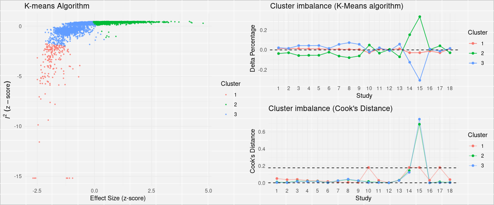<!-- -->

Gráfico da analises de heterogeneidade usando DBSCAN

``` r
plot(gda.out$db.plot)
```

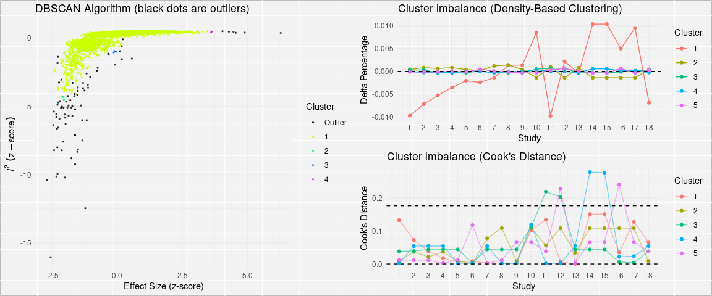<!-- -->

Gráfico da analises de heterogeneidade usando gaussian-mixed model

``` r
plot(gda.out$gmm.plot)
```

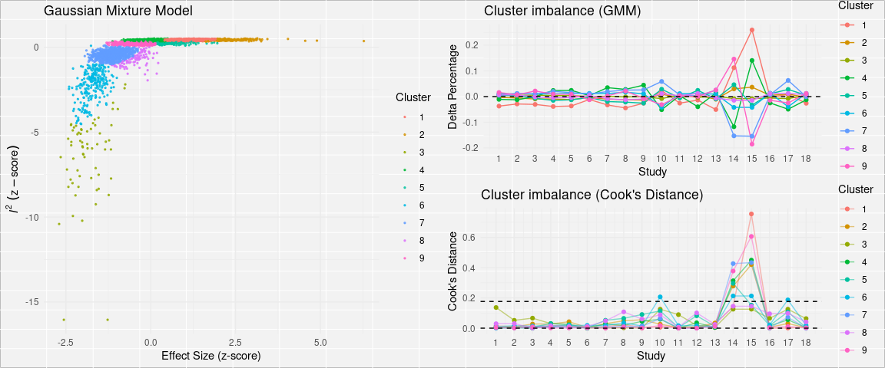<!-- -->

## Efeituar metanálise sem outliers

``` r
(m <- metacont(Ne, Me, Se, Nc, Mc, Sc, data = madata
               , studlab = paste(Author)
               , exclude = c(15,6,18,4)
               , comb.fixed = F, comb.random = T
               , sm = "SMD"))
```

    ##                            SMD             95%-CI %W(random) exclude
    ## Call et al.            -0.4097 [-0.9305;  0.1111]        7.0        
    ## Cavanagh et al.        -0.2670 [-0.6716;  0.1376]        7.2        
    ## DanitzOrsillo          -0.7782 [-1.2806; -0.2758]        7.0        
    ## de Vibe et al.         -0.7444 [-1.0699; -0.4188]        0.0       *
    ## Frazier et al.         -0.7473 [-1.0473; -0.4474]        7.4        
    ## Frogeli et al.         -0.1928 [-0.4633;  0.0777]        0.0       *
    ## Gallego et al.         -0.9015 [-1.1786; -0.6244]        7.4        
    ## Hazlett-Stevens & Oren -1.1542 [-1.6043; -0.7041]        7.1        
    ## Hintz et al.           -0.8890 [-1.1203; -0.6577]        7.5        
    ## Kang et al.             1.0694 [ 0.7346;  1.4041]        7.3        
    ## Kuhlmann et al.        -0.3620 [-0.6575; -0.0666]        7.4        
    ## Lever Taylor et al.     0.3558 [-0.2427;  0.9543]        6.8        
    ## Phang et al.           -1.0270 [-1.6593; -0.3947]        6.7        
    ## Rasanen et al.          3.2796 [ 2.6044;  3.9548]        6.6        
    ## Ratanasiripong          4.7474 [ 3.9792;  5.5157]        0.0       *
    ## Shapiro et al.          0.2926 [-0.0190;  0.6042]        7.3        
    ## SongLindquist           0.9382 [ 0.6176;  1.2588]        7.3        
    ## Warnecke et al.        -0.2680 [-0.6871;  0.1511]        0.0       *
    ## 
    ## Number of studies combined: k = 14
    ## 
    ##                          SMD            95%-CI     z p-value
    ## Random effects model -0.0586 [-0.5442; 0.4271] -0.24  0.8132
    ## 
    ## Quantifying heterogeneity:
    ##  tau^2 = 0.8102 [0.5087; 2.8193]; tau = 0.9001 [0.7133; 1.6791]
    ##  I^2 = 95.9% [94.5%; 97.0%]; H = 4.96 [4.25; 5.79]
    ## 
    ## Test of heterogeneity:
    ##       Q d.f.  p-value
    ##  320.44   13 < 0.0001
    ## 
    ## Details on meta-analytical method:
    ## - Inverse variance method
    ## - DerSimonian-Laird estimator for tau^2
    ## - Jackson method for confidence interval of tau^2 and tau
    ## - Hedges' g (bias corrected standardised mean difference)

# Step 4: Forest plot da metanálise sem outliers

``` r
forest(m, digits=2, digits.sd = 2, test.overall = T, lab.e = "Intervention")
```

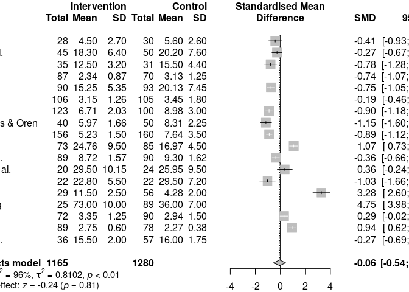<!-- -->

# Step 5: Metanálises usando subgrupos

## Metanálises agrupando estudos por: população

``` r
(m.sg4p <- update.meta(m, byvar=population, comb.random = T, comb.fixed = F))
```

    ##                            SMD             95%-CI %W(random)
    ## Call et al.            -0.4097 [-0.9305;  0.1111]        7.0
    ## Cavanagh et al.        -0.2670 [-0.6716;  0.1376]        7.2
    ## DanitzOrsillo          -0.7782 [-1.2806; -0.2758]        7.0
    ## de Vibe et al.         -0.7444 [-1.0699; -0.4188]        0.0
    ## Frazier et al.         -0.7473 [-1.0473; -0.4474]        7.4
    ## Frogeli et al.         -0.1928 [-0.4633;  0.0777]        0.0
    ## Gallego et al.         -0.9015 [-1.1786; -0.6244]        7.4
    ## Hazlett-Stevens & Oren -1.1542 [-1.6043; -0.7041]        7.1
    ## Hintz et al.           -0.8890 [-1.1203; -0.6577]        7.5
    ## Kang et al.             1.0694 [ 0.7346;  1.4041]        7.3
    ## Kuhlmann et al.        -0.3620 [-0.6575; -0.0666]        7.4
    ## Lever Taylor et al.     0.3558 [-0.2427;  0.9543]        6.8
    ## Phang et al.           -1.0270 [-1.6593; -0.3947]        6.7
    ## Rasanen et al.          3.2796 [ 2.6044;  3.9548]        6.6
    ## Ratanasiripong          4.7474 [ 3.9792;  5.5157]        0.0
    ## Shapiro et al.          0.2926 [-0.0190;  0.6042]        7.3
    ## SongLindquist           0.9382 [ 0.6176;  1.2588]        7.3
    ## Warnecke et al.        -0.2680 [-0.6871;  0.1511]        0.0
    ##                                       population exclude
    ## Call et al.               undergraduate students        
    ## Cavanagh et al.        higher education students        
    ## DanitzOrsillo             undergraduate students        
    ## de Vibe et al.            undergraduate students       *
    ## Frazier et al.         higher education students        
    ## Frogeli et al.            undergraduate students       *
    ## Gallego et al.            undergraduate students        
    ## Hazlett-Stevens & Oren higher education students        
    ## Hintz et al.              undergraduate students        
    ## Kang et al.            higher education students        
    ## Kuhlmann et al.        higher education students        
    ## Lever Taylor et al.    higher education students        
    ## Phang et al.           higher education students        
    ## Rasanen et al.         higher education students        
    ## Ratanasiripong            undergraduate students       *
    ## Shapiro et al.            undergraduate students        
    ## SongLindquist             undergraduate students        
    ## Warnecke et al.        higher education students       *
    ## 
    ## Number of studies combined: k = 14
    ## 
    ##                          SMD            95%-CI     z p-value
    ## Random effects model -0.0586 [-0.5442; 0.4271] -0.24  0.8132
    ## 
    ## Quantifying heterogeneity:
    ##  tau^2 = 0.8102 [0.5087; 2.8193]; tau = 0.9001 [0.7133; 1.6791]
    ##  I^2 = 95.9% [94.5%; 97.0%]; H = 4.96 [4.25; 5.79]
    ## 
    ## Test of heterogeneity:
    ##       Q d.f.  p-value
    ##  320.44   13 < 0.0001
    ## 
    ## Results for subgroups (random effects model):
    ##                                          k     SMD            95%-CI  tau^2
    ## population = undergraduate students      6 -0.2882 [-0.9388; 0.3623] 0.6248
    ## population = higher education students   8  0.1259 [-0.6458; 0.8976] 1.1804
    ##                                           tau      Q   I^2
    ## population = undergraduate students    0.7904 117.28 95.7%
    ## population = higher education students 1.0865 196.22 96.4%
    ## 
    ## Test for subgroup differences (random effects model):
    ##                     Q d.f. p-value
    ## Between groups   0.65    1  0.4212
    ## 
    ## Details on meta-analytical method:
    ## - Inverse variance method
    ## - DerSimonian-Laird estimator for tau^2
    ## - Jackson method for confidence interval of tau^2 and tau
    ## - Hedges' g (bias corrected standardised mean difference)

*Observação*: A função `update.meda` efeitua a análises de subgrupos
usando random-effect model como método de cálculo do efeito geral na
metanálise. Para o uso de fixed-effect model como método de cálculo do
efeito geral, emprege a função `subgroup.analysis` como mostrado a
seguir:

    (m.sg4p <- subgroup.analysis.mixed.effects(x = m, subgroups = madata$population))

``` r
forest(m.sg4p, digits=2, digits.sd = 2, test.overall = T, lab.e = "Intervention")
```

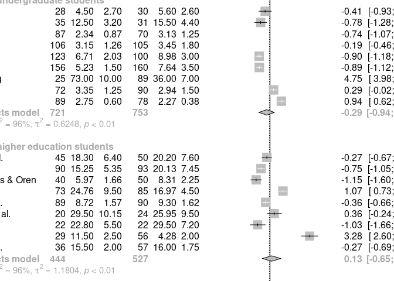<!-- -->

## Metanálises agrupando estudos por: contexto

``` r
(m.sg4ctx <- update.meta(m, byvar=context, comb.random = T, comb.fixed = F))
```

    ##                            SMD             95%-CI %W(random)     context
    ## Call et al.            -0.4097 [-0.9305;  0.1111]        7.0  psychology
    ## Cavanagh et al.        -0.2670 [-0.6716;  0.1376]        7.2       steam
    ## DanitzOrsillo          -0.7782 [-1.2806; -0.2758]        7.0 unspecified
    ## de Vibe et al.         -0.7444 [-1.0699; -0.4188]        0.0       steam
    ## Frazier et al.         -0.7473 [-1.0473; -0.4474]        7.4     medical
    ## Frogeli et al.         -0.1928 [-0.4633;  0.0777]        0.0       steam
    ## Gallego et al.         -0.9015 [-1.1786; -0.6244]        7.4       steam
    ## Hazlett-Stevens & Oren -1.1542 [-1.6043; -0.7041]        7.1       steam
    ## Hintz et al.           -0.8890 [-1.1203; -0.6577]        7.5     medical
    ## Kang et al.             1.0694 [ 0.7346;  1.4041]        7.3     medical
    ## Kuhlmann et al.        -0.3620 [-0.6575; -0.0666]        7.4       steam
    ## Lever Taylor et al.     0.3558 [-0.2427;  0.9543]        6.8     general
    ## Phang et al.           -1.0270 [-1.6593; -0.3947]        6.7     medical
    ## Rasanen et al.          3.2796 [ 2.6044;  3.9548]        6.6       steam
    ## Ratanasiripong          4.7474 [ 3.9792;  5.5157]        0.0     medical
    ## Shapiro et al.          0.2926 [-0.0190;  0.6042]        7.3       steam
    ## SongLindquist           0.9382 [ 0.6176;  1.2588]        7.3     medical
    ## Warnecke et al.        -0.2680 [-0.6871;  0.1511]        0.0     medical
    ##                        exclude
    ## Call et al.                   
    ## Cavanagh et al.               
    ## DanitzOrsillo                 
    ## de Vibe et al.               *
    ## Frazier et al.                
    ## Frogeli et al.               *
    ## Gallego et al.                
    ## Hazlett-Stevens & Oren        
    ## Hintz et al.                  
    ## Kang et al.                   
    ## Kuhlmann et al.               
    ## Lever Taylor et al.           
    ## Phang et al.                  
    ## Rasanen et al.                
    ## Ratanasiripong               *
    ## Shapiro et al.                
    ## SongLindquist                 
    ## Warnecke et al.              *
    ## 
    ## Number of studies combined: k = 14
    ## 
    ##                          SMD            95%-CI     z p-value
    ## Random effects model -0.0586 [-0.5442; 0.4271] -0.24  0.8132
    ## 
    ## Quantifying heterogeneity:
    ##  tau^2 = 0.8102 [0.5087; 2.8193]; tau = 0.9001 [0.7133; 1.6791]
    ##  I^2 = 95.9% [94.5%; 97.0%]; H = 4.96 [4.25; 5.79]
    ## 
    ## Test of heterogeneity:
    ##       Q d.f.  p-value
    ##  320.44   13 < 0.0001
    ## 
    ## Results for subgroups (random effects model):
    ##                         k     SMD             95%-CI  tau^2    tau      Q   I^2
    ## context = psychology    1 -0.4097 [-0.9305;  0.1111]     --     --   0.00    --
    ## context = steam         6  0.1098 [-0.7145;  0.9341] 1.0153 1.0076 153.84 96.7%
    ## context = unspecified   1 -0.7782 [-1.2806; -0.2758]     --     --   0.00    --
    ## context = medical       5 -0.1218 [-1.0338;  0.7902] 1.0441 1.0218 156.96 97.5%
    ## context = general       1  0.3558 [-0.2427;  0.9543]     --     --   0.00    --
    ## 
    ## Test for subgroup differences (random effects model):
    ##                     Q d.f. p-value
    ## Between groups   9.32    4  0.0535
    ## 
    ## Details on meta-analytical method:
    ## - Inverse variance method
    ## - DerSimonian-Laird estimator for tau^2
    ## - Jackson method for confidence interval of tau^2 and tau
    ## - Hedges' g (bias corrected standardised mean difference)

criar o gráfico da metanálise por subgrupo (forest plot)

``` r
forest(m.sg4ctx, digits=2, digits.sd = 2, test.overall = T, lab.e = "Intervention")
```

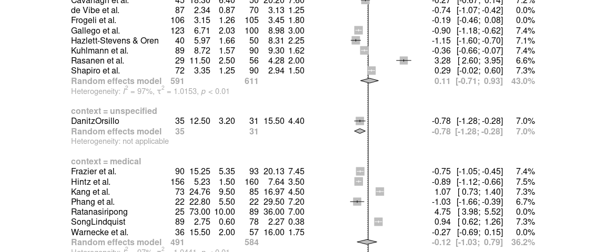<!-- -->

## Metanálises agrupando estudos por: duração

``` r
(m.sg4d <- subgroup.analysis.mixed.effects(x = m, subgroups = madata$duration))
```

    ## Subgroup Results:
    ## --------------
    ##        k        SMD        SE   LLCI  ULCI         p        Q   I2 I2.lower
    ## long   7  0.1013264 0.3922494 -0.667 0.870 0.7961588 140.6436 0.96     0.94
    ## short 11 -0.1843352 0.3106880 -0.793 0.425 0.5529717 139.8738 0.95     0.92
    ##       I2.upper
    ## long      0.98
    ## short     0.97
    ## 
    ## Test for subgroup differences (mixed/fixed-effects (plural) model):
    ## --------------
    ##                        Q df         p
    ## Between groups 0.3259063  1 0.5680796
    ## 
    ## - Total number of studies included in subgroup analysis:  18
    ## - Tau estimator used for within-group pooling:  DL

criar o gráfico da metanálise por subgrupo (forest plot)

``` r
forest(m.sg4d, digits=2, digits.sd = 2, test.overall = T, lab.e = "Intervention")
```

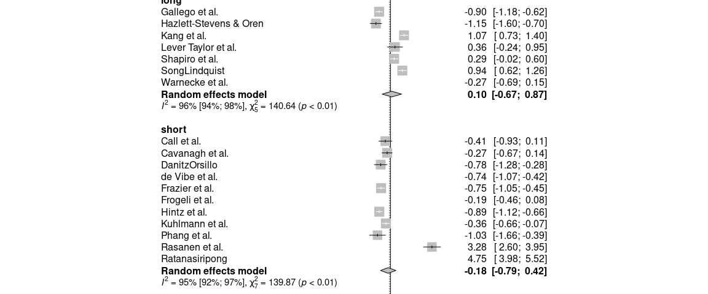<!-- -->

## Metanálises agrupando estudos por: intervention

``` r
(m.sg4i <- update.meta(m, byvar=intervention, comb.random = T, comb.fixed = F))
```

    ##                            SMD             95%-CI %W(random) intervention
    ## Call et al.            -0.4097 [-0.9305;  0.1111]        7.0  mindfulness
    ## Cavanagh et al.        -0.2670 [-0.6716;  0.1376]        7.2  mindfulness
    ## DanitzOrsillo          -0.7782 [-1.2806; -0.2758]        7.0          ACT
    ## de Vibe et al.         -0.7444 [-1.0699; -0.4188]        0.0  mindfulness
    ## Frazier et al.         -0.7473 [-1.0473; -0.4474]        7.4          ACT
    ## Frogeli et al.         -0.1928 [-0.4633;  0.0777]        0.0          ACT
    ## Gallego et al.         -0.9015 [-1.1786; -0.6244]        7.4  mindfulness
    ## Hazlett-Stevens & Oren -1.1542 [-1.6043; -0.7041]        7.1  mindfulness
    ## Hintz et al.           -0.8890 [-1.1203; -0.6577]        7.5          ACT
    ## Kang et al.             1.0694 [ 0.7346;  1.4041]        7.3  mindfulness
    ## Kuhlmann et al.        -0.3620 [-0.6575; -0.0666]        7.4  mindfulness
    ## Lever Taylor et al.     0.3558 [-0.2427;  0.9543]        6.8  mindfulness
    ## Phang et al.           -1.0270 [-1.6593; -0.3947]        6.7  mindfulness
    ## Rasanen et al.          3.2796 [ 2.6044;  3.9548]        6.6          ACT
    ## Ratanasiripong          4.7474 [ 3.9792;  5.5157]        0.0  mindfulness
    ## Shapiro et al.          0.2926 [-0.0190;  0.6042]        7.3  mindfulness
    ## SongLindquist           0.9382 [ 0.6176;  1.2588]        7.3  mindfulness
    ## Warnecke et al.        -0.2680 [-0.6871;  0.1511]        0.0          ACT
    ##                        exclude
    ## Call et al.                   
    ## Cavanagh et al.               
    ## DanitzOrsillo                 
    ## de Vibe et al.               *
    ## Frazier et al.                
    ## Frogeli et al.               *
    ## Gallego et al.                
    ## Hazlett-Stevens & Oren        
    ## Hintz et al.                  
    ## Kang et al.                   
    ## Kuhlmann et al.               
    ## Lever Taylor et al.           
    ## Phang et al.                  
    ## Rasanen et al.                
    ## Ratanasiripong               *
    ## Shapiro et al.                
    ## SongLindquist                 
    ## Warnecke et al.              *
    ## 
    ## Number of studies combined: k = 14
    ## 
    ##                          SMD            95%-CI     z p-value
    ## Random effects model -0.0586 [-0.5442; 0.4271] -0.24  0.8132
    ## 
    ## Quantifying heterogeneity:
    ##  tau^2 = 0.8102 [0.5087; 2.8193]; tau = 0.9001 [0.7133; 1.6791]
    ##  I^2 = 95.9% [94.5%; 97.0%]; H = 4.96 [4.25; 5.79]
    ## 
    ## Test of heterogeneity:
    ##       Q d.f.  p-value
    ##  320.44   13 < 0.0001
    ## 
    ## Results for subgroups (random effects model):
    ##                              k     SMD            95%-CI  tau^2    tau      Q
    ## intervention = mindfulness  10 -0.1369 [-0.6424; 0.3685] 0.6175 0.7858 161.60
    ## intervention = ACT           4  0.1763 [-1.0593; 1.4118] 1.5353 1.2391 134.16
    ##                              I^2
    ## intervention = mindfulness 94.4%
    ## intervention = ACT         97.8%
    ## 
    ## Test for subgroup differences (random effects model):
    ##                     Q d.f. p-value
    ## Between groups   0.21    1  0.6456
    ## 
    ## Details on meta-analytical method:
    ## - Inverse variance method
    ## - DerSimonian-Laird estimator for tau^2
    ## - Jackson method for confidence interval of tau^2 and tau
    ## - Hedges' g (bias corrected standardised mean difference)

criar o gráfico da metanálise por subgrupo (forest plot)

``` r
forest(m.sg4i, digits=2, digits.sd = 2, test.overall = T, lab.e = "Intervention")
```

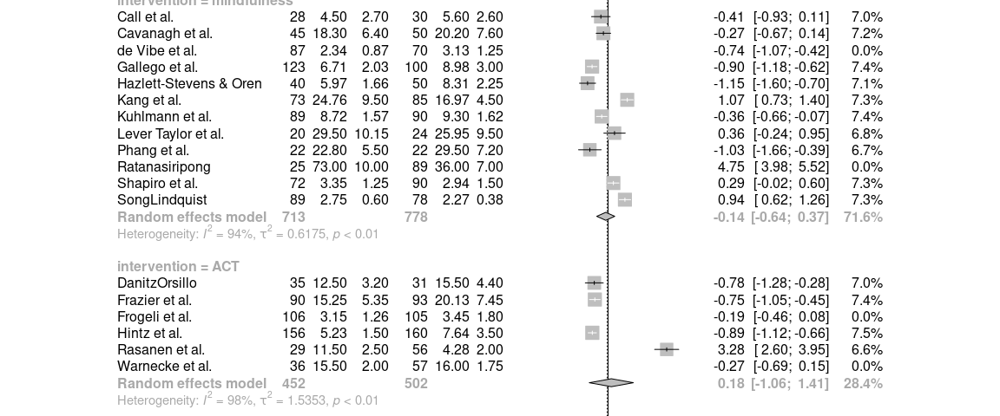<!-- -->

## Metanálises agrupando estudos por: control

``` r
(m.sg4c <- update.meta(m, byvar=control, comb.random = T, comb.fixed = F))
```

    ##                            SMD             95%-CI %W(random)          control
    ## Call et al.            -0.4097 [-0.9305;  0.1111]        7.0              WLC
    ## Cavanagh et al.        -0.2670 [-0.6716;  0.1376]        7.2              WLC
    ## DanitzOrsillo          -0.7782 [-1.2806; -0.2758]        7.0              WLC
    ## de Vibe et al.         -0.7444 [-1.0699; -0.4188]        0.0 information only
    ## Frazier et al.         -0.7473 [-1.0473; -0.4474]        7.4 information only
    ## Frogeli et al.         -0.1928 [-0.4633;  0.0777]        0.0  no intervention
    ## Gallego et al.         -0.9015 [-1.1786; -0.6244]        7.4  no intervention
    ## Hazlett-Stevens & Oren -1.1542 [-1.6043; -0.7041]        7.1  no intervention
    ## Hintz et al.           -0.8890 [-1.1203; -0.6577]        7.5 information only
    ## Kang et al.             1.0694 [ 0.7346;  1.4041]        7.3  no intervention
    ## Kuhlmann et al.        -0.3620 [-0.6575; -0.0666]        7.4  no intervention
    ## Lever Taylor et al.     0.3558 [-0.2427;  0.9543]        6.8              WLC
    ## Phang et al.           -1.0270 [-1.6593; -0.3947]        6.7 information only
    ## Rasanen et al.          3.2796 [ 2.6044;  3.9548]        6.6              WLC
    ## Ratanasiripong          4.7474 [ 3.9792;  5.5157]        0.0 information only
    ## Shapiro et al.          0.2926 [-0.0190;  0.6042]        7.3              WLC
    ## SongLindquist           0.9382 [ 0.6176;  1.2588]        7.3              WLC
    ## Warnecke et al.        -0.2680 [-0.6871;  0.1511]        0.0 information only
    ##                        exclude
    ## Call et al.                   
    ## Cavanagh et al.               
    ## DanitzOrsillo                 
    ## de Vibe et al.               *
    ## Frazier et al.                
    ## Frogeli et al.               *
    ## Gallego et al.                
    ## Hazlett-Stevens & Oren        
    ## Hintz et al.                  
    ## Kang et al.                   
    ## Kuhlmann et al.               
    ## Lever Taylor et al.           
    ## Phang et al.                  
    ## Rasanen et al.                
    ## Ratanasiripong               *
    ## Shapiro et al.                
    ## SongLindquist                 
    ## Warnecke et al.              *
    ## 
    ## Number of studies combined: k = 14
    ## 
    ##                          SMD            95%-CI     z p-value
    ## Random effects model -0.0586 [-0.5442; 0.4271] -0.24  0.8132
    ## 
    ## Quantifying heterogeneity:
    ##  tau^2 = 0.8102 [0.5087; 2.8193]; tau = 0.9001 [0.7133; 1.6791]
    ##  I^2 = 95.9% [94.5%; 97.0%]; H = 4.96 [4.25; 5.79]
    ## 
    ## Test of heterogeneity:
    ##       Q d.f.  p-value
    ##  320.44   13 < 0.0001
    ## 
    ## Results for subgroups (random effects model):
    ##                              k     SMD             95%-CI  tau^2    tau      Q
    ## control = WLC                7  0.4677 [-0.2797;  1.2151] 0.9556 0.9776 121.83
    ## control = information only   3 -0.8510 [-1.0269; -0.6750]      0      0   0.86
    ## control = no intervention    4 -0.3334 [-1.2660;  0.5993] 0.8747 0.9353  96.35
    ##                              I^2
    ## control = WLC              95.1%
    ## control = information only  0.0%
    ## control = no intervention  96.9%
    ## 
    ## Test for subgroup differences (random effects model):
    ##                      Q d.f. p-value
    ## Between groups   12.19    2  0.0023
    ## 
    ## Details on meta-analytical method:
    ## - Inverse variance method
    ## - DerSimonian-Laird estimator for tau^2
    ## - Jackson method for confidence interval of tau^2 and tau
    ## - Hedges' g (bias corrected standardised mean difference)

criar o gráfico da metanálise por subgrupo (forest plot)

``` r
forest(m.sg4c, digits=2, digits.sd = 2, test.overall = T, lab.e = "Intervention")
```

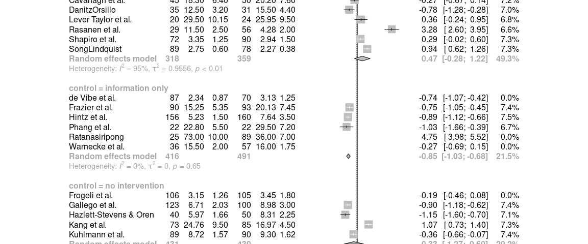<!-- -->

## Metanálises agrupando estudos por: instrumento (usado para medir)

``` r
(m.sg4ins <- update.meta(m, byvar=instrument, comb.random = T, comb.fixed = F))
```

    ##                            SMD             95%-CI %W(random) instrument exclude
    ## Call et al.            -0.4097 [-0.9305;  0.1111]        7.0       DASS        
    ## Cavanagh et al.        -0.2670 [-0.6716;  0.1376]        7.2        PSS        
    ## DanitzOrsillo          -0.7782 [-1.2806; -0.2758]        7.0       DASS        
    ## de Vibe et al.         -0.7444 [-1.0699; -0.4188]        0.0      other       *
    ## Frazier et al.         -0.7473 [-1.0473; -0.4474]        7.4        PSS        
    ## Frogeli et al.         -0.1928 [-0.4633;  0.0777]        0.0        PSS       *
    ## Gallego et al.         -0.9015 [-1.1786; -0.6244]        7.4       DASS        
    ## Hazlett-Stevens & Oren -1.1542 [-1.6043; -0.7041]        7.1        PSS        
    ## Hintz et al.           -0.8890 [-1.1203; -0.6577]        7.5        PSS        
    ## Kang et al.             1.0694 [ 0.7346;  1.4041]        7.3      other        
    ## Kuhlmann et al.        -0.3620 [-0.6575; -0.0666]        7.4      other        
    ## Lever Taylor et al.     0.3558 [-0.2427;  0.9543]        6.8       DASS        
    ## Phang et al.           -1.0270 [-1.6593; -0.3947]        6.7        PSS        
    ## Rasanen et al.          3.2796 [ 2.6044;  3.9548]        6.6        PSS        
    ## Ratanasiripong          4.7474 [ 3.9792;  5.5157]        0.0        PSS       *
    ## Shapiro et al.          0.2926 [-0.0190;  0.6042]        7.3        PSS        
    ## SongLindquist           0.9382 [ 0.6176;  1.2588]        7.3       DASS        
    ## Warnecke et al.        -0.2680 [-0.6871;  0.1511]        0.0        PSS       *
    ## 
    ## Number of studies combined: k = 14
    ## 
    ##                          SMD            95%-CI     z p-value
    ## Random effects model -0.0586 [-0.5442; 0.4271] -0.24  0.8132
    ## 
    ## Quantifying heterogeneity:
    ##  tau^2 = 0.8102 [0.5087; 2.8193]; tau = 0.9001 [0.7133; 1.6791]
    ##  I^2 = 95.9% [94.5%; 97.0%]; H = 4.96 [4.25; 5.79]
    ## 
    ## Test of heterogeneity:
    ##       Q d.f.  p-value
    ##  320.44   13 < 0.0001
    ## 
    ## Results for subgroups (random effects model):
    ##                      k     SMD            95%-CI  tau^2    tau      Q   I^2
    ## instrument = DASS    5 -0.1599 [-0.9900; 0.6702] 0.8424 0.9178  82.04 95.1%
    ## instrument = PSS     7 -0.1021 [-0.8500; 0.6459] 0.9665 0.9831 170.01 96.5%
    ## instrument = other   2  0.3514 [-1.0513; 1.7541] 0.9985 0.9992  39.48 97.5%
    ## 
    ## Test for subgroup differences (random effects model):
    ##                     Q d.f. p-value
    ## Between groups   0.40    2  0.8195
    ## 
    ## Details on meta-analytical method:
    ## - Inverse variance method
    ## - DerSimonian-Laird estimator for tau^2
    ## - Jackson method for confidence interval of tau^2 and tau
    ## - Hedges' g (bias corrected standardised mean difference)

criar o gráfico da metanálise por subgrupo (forest plot)

``` r
forest(m.sg4ins, digits=2, digits.sd = 2, test.overall = T, lab.e = "Intervention")
```

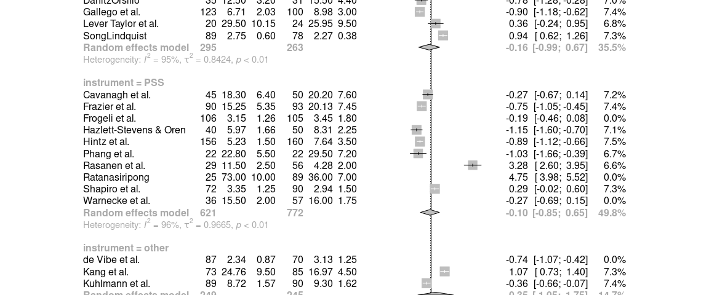<!-- -->

# Step 6: Análises de viés de publicação usando Funel plot

criar gráfico de funil com etiquetas

``` r
funnel(m, xlab = "Hedges' g", studlab = T)
```

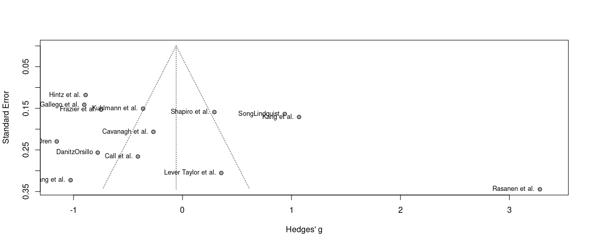<!-- -->

*Observação*: Entendendo o gráfico de funnel plot em
<https://www.statisticshowto.com/funnel-plot/>

Efeituar teste de Eggers

``` r
summary(eggers.test(x = m))
```

    ## Eggers' test of the intercept 
    ## ============================= 
    ## 
    ##  intercept        95% CI     t    p
    ##      4.867 -3.64 - 13.38 1.121 0.28
    ## 
    ## Eggers' test does not indicate the presence of funnel plot asymmetry.

Valor p abaixo de 0.05 no resultado sugere forte probabilidade da
distribuição ser por acaso, sugerindo viés de publicação.
